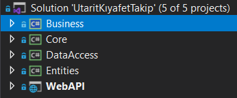
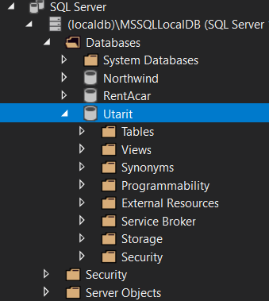
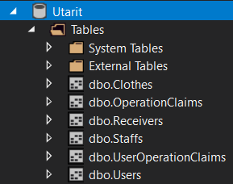
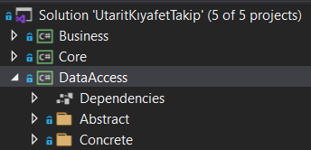
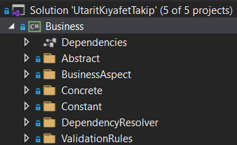
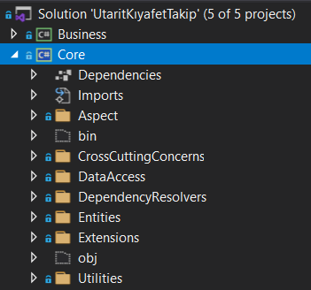
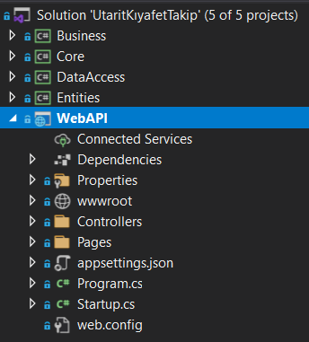

# Utarit Clothe Tracking System 

The project is a multi-layered project based on SOLID principles. This project is the backend side of KiyafetTakip project in my repositories. You can check the frontend project here => [KiyafetTakip-Frontend](https://github.com/NecibeBusraUylas/KiyafetTakip-Frontend)

The project consists of 5 layers: Entities, DataAccess, Business, Core and WebAPI.

Each operation is controlled by its own manager that uses Dal classes to implement crud operations. All data access layers implement generic IEntityRepository interface as a common outline.

Autofac IoC Container is used for Dependency Injection and Aspect Oriented Programming was implemented.

Validation is a Cross Cutting Concern and as regard of AOP, Validation Aspect is created with Autofac using Interceptors. FluentValidation is the Validation Tool used for the verification process.

## Database and Tables

The CREATE DATABASE statement is used to create a new SQL database.
`CREATE DATABASE Utarit`

The CREATE TABLE statement is used to create a new table.
~~~~sql
CREATE TABLE [dbo].[Clothes] (
    [Id]   INT           IDENTITY (1, 1) NOT NULL,
    [Type] VARCHAR (100) NOT NULL,
    CONSTRAINT [PK_Clothes] PRIMARY KEY CLUSTERED ([Id] ASC)
);
CREATE TABLE [dbo].[OperationClaims] (
    [Id]   INT           IDENTITY (1, 1) NOT NULL,
    [Name] VARCHAR (250) NOT NULL,
    PRIMARY KEY CLUSTERED ([Id] ASC)
);
CREATE TABLE [dbo].[Receivers] (
    [Id]             INT           NOT NULL,
    [EmployeeNumber] BIGINT        NOT NULL,
    [NameSurname]    VARCHAR (150) NOT NULL,
    [CardNumber]     VARCHAR (10)  NOT NULL,
    [Division]       VARCHAR (50)  NOT NULL,
    [Department]     VARCHAR (50)  NOT NULL,
    [Clothe]         VARCHAR (50)  NOT NULL,
    [Time]           VARCHAR (50)  NOT NULL,
    CONSTRAINT [PK_Receivers] PRIMARY KEY CLUSTERED ([Id] ASC)
);
CREATE TABLE [dbo].[Staffs] (
    [Id]             INT           IDENTITY (1, 1) NOT NULL,
    [EmployeeNumber] BIGINT        NOT NULL,
    [NameSurname]    VARCHAR (150) NOT NULL,
    [CardNumber]     VARCHAR (10)  NOT NULL,
    [Division]       VARCHAR (50)  NOT NULL,
    [Department]     VARCHAR (50)  NOT NULL,
    [isActive]       INT           NOT NULL,
    [isAdded]        INT           NOT NULL,
    CONSTRAINT [PK_Staffs] PRIMARY KEY CLUSTERED ([Id] ASC)
);
CREATE TABLE [dbo].[UserOperationClaims] (
    [Id]               INT IDENTITY (1, 1) NOT NULL,
    [UserId]           INT NOT NULL,
    [OperationClaimId] INT NOT NULL,
    PRIMARY KEY CLUSTERED ([Id] ASC),
    FOREIGN KEY ([OperationClaimId]) REFERENCES [dbo].[OperationClaims] ([Id])
);
CREATE TABLE [dbo].[Users] (
    [Id]           INT             IDENTITY (1, 1) NOT NULL,
    [NameSurname]  VARCHAR (150)   NOT NULL,
    [UserName]     VARCHAR (150)   NOT NULL,
    [PasswordHash] VARBINARY (500) NOT NULL,
    [PasswordSalt] VARBINARY (500) NOT NULL,
    [Status]       BIT             NOT NULL,
    [Admin]        BIT             NOT NULL,
    PRIMARY KEY CLUSTERED ([Id] ASC)
);
~~~~

## Layers
### **1. Entities Layer**
The Entity Layer defines the entities and relationships. An entity is a placeholder for a database object or a database object which is created by joining two different tables. 

### **2. Data Access Layer**
The Data Access layer (DAL) provides simplified access to data stored in persistent storage. 

### **3. Business Layer**
The Business layer handles all of the business rules, calculations and actual logic within your application and it may often use some of the objects retrieved from your data-access layer. 

### **4. Core Layer**
The Core layer stores the codes that are used almost all project in the same way. 

### **5.WebAPI Layer**

The Web API layer provides communication or interaction between software applications. Web API is often used to provide an interface for web sites and client applications to have data access. 

